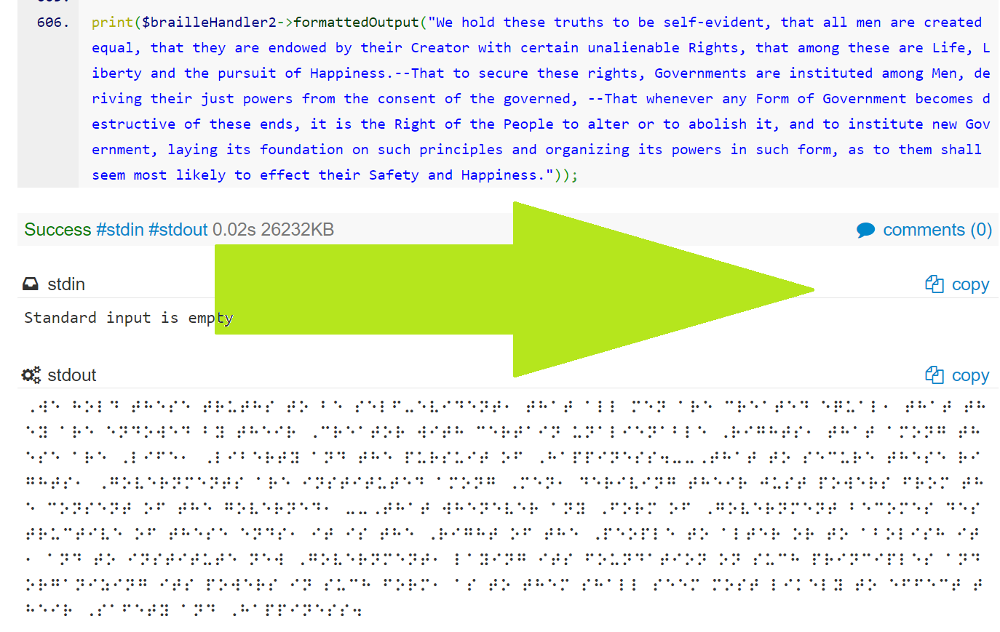
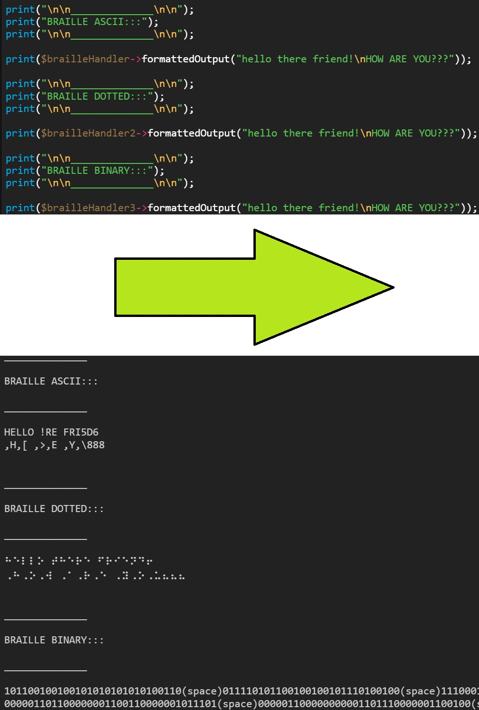

# English to Braille (in PHP)

Convert your English to Braille in PHP.

## What YOU Do

* Give the program ENGLISH text.

## What WE Do

* Give you the output of the English text in braille, using ascii-format (machine-readable), dotted-format (human-readable), and binary-format (for more intricate projects).

## What are these formats?

* **Ascii Braille**: This is a special, machine-readable Braille designed for devices to assist humans.
* **Dotted Braille**: This is the ordinary Braille you are familiar with, using UTF-8 dotted sequence.
* **Binary Braille**: This is a sequence of strings composed of sets of 6 bits, with each bit (left to right, top to bottom) being on representing a dot, and being off representing the absence of a dot.  I.E., 010000 is equivalent to a six-dotted character with the first dot empty, the second dot full, and the remaining four dots empty.

You can set the mode of your braille converter when it is initialized, for instance...

    $braille = new brailleHandler(['mode'=>'ascii']);

## Special Thanks

Special thanks to https://github.com/wimulkeman/PHP_Braille_converter for building the original basis of this Braille converter in 2015!
